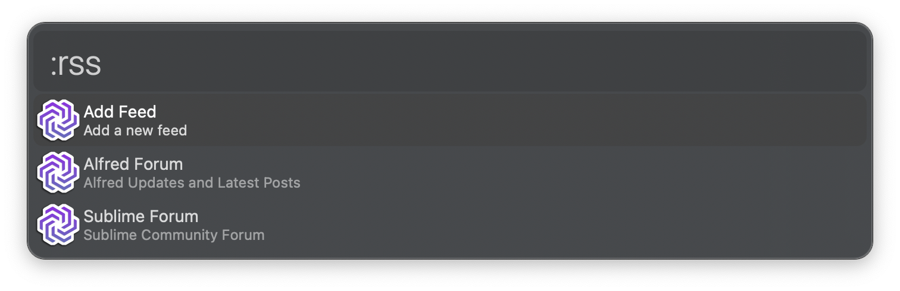
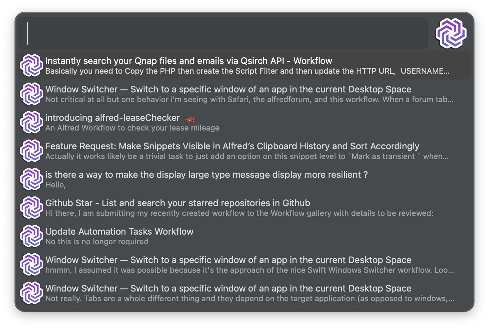

# RSS Feed

RSS Feed is an Alfred workflow that supports fetching various RSS Feeds. Feeds are supplied by the user via adding them to the respective configuration file.

This workflow will do the following:

1. Check if `~/.alfred_feeds` exists
2. Create it if it does not exists
3. Load `~/.alfred_feeds/.feeds.json` and create it if it does not exists

## RSS Feeds

## RSS Loading

## RSS Posts

